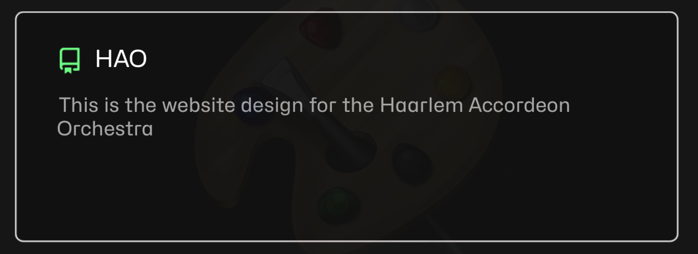

## GitHub users



  
    
  



---


  
    
      <h4>{{ user }}</h4>
    
    

      
    

  


## Repositories



  
    
  



<!-- Show the HAO gitlab page -->

  


  

  
    <a style="font-size: 1.5rem;" href="{{ org.link }}">{{ org.name }}</a>
    

      
        
      
    

  
  



